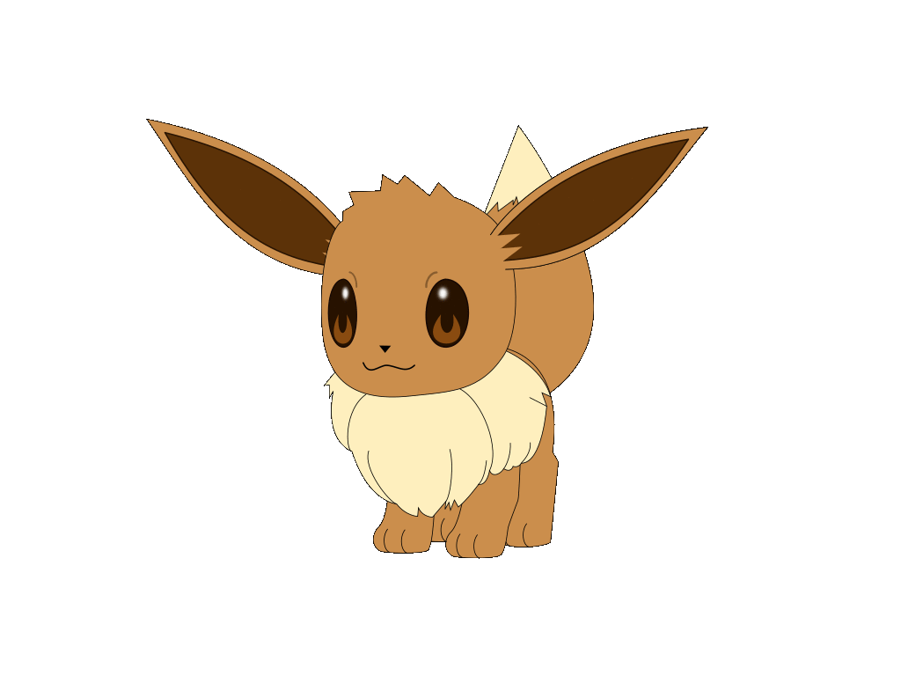

<!--  -->
<h1 align="center">I'm Om Vatsal!</h1>

  

### 💫 About Me:

  Hello Folks! It's Om Vatsal this side, your friendly neighborhood coder and enthusiast for all things tech! Delighted to welcome you to my corner of GitHub, where innovation meets collaboration. As an avid advocate for clean code and creative solutions, I'm thrilled to share my passion for software development with fellow enthusiasts like you. Join me on this exciting journey as we explore the endless possibilities of technology together. Let's code, create, and make magic happen!
  <code>🚀👨‍💻 #HappyCoding</code>

- <b>Experience:</b> 3 Years (2020-2023);
- <b>Expertise:</b> Python;
- Currently persuing a B.Tech degree program in Computer Science & Engineering.
- I am interested in research and development.
- I have contributed to some open-source organisations. 
- I enjoy competitive programming.

---

## 📈 Stats:

 

## 🏆 GitHub Trophies

## Languages and Tools 

### Languages:
| Python3 | C | JS | Solidity | GO |
|----------|----------|----------|-----|-----|
|   |   |   |  |  | 

  

### Best frameworks and main libraries for Python3:

| Pytorch | Selenium | Numpy | Pandas | Sklearn | OpenCV |
|----------|----------|----------|----------|----------|----------|
|  |  |  |  |  | |

### My tools for Data Manipulation & Visualisation:

| Conda | Jupyter | Spark | MySQL | Postgres | SQLite | Plotly | Matpltlib |
|----------|----------|----------|----------|----------|----------|----------|----------|
||||||| |  |

  
### Environments, Testing, Other:

| nodejs | Git | Docker | Pytest | Swagger | Postman | VBox | HardHat | Kafka |
|----------|----------|----------|----------|----------|----------|----------|----------|----------|
|||||  |  || | |

### OS:

| Linux | Ubuntu | Kali |
|----------|----------|----------|
|  |  |  |

### Tools for CTF's
 
| Metasploit | Wireshark | Burpsuite | Netcat | Nmap |
|----------|----------|----------|----------|----------|
||||||

### It's not technology, but I use it. The section will be changed soon.:
  
  
  
  
  
  
  
  
    
  
  
  

## 🌐 Social:

<button><a href="https://stars.github.com/nominate/"><em>If you admire this, please nominate me for GitHub Star.</em></a></button>
